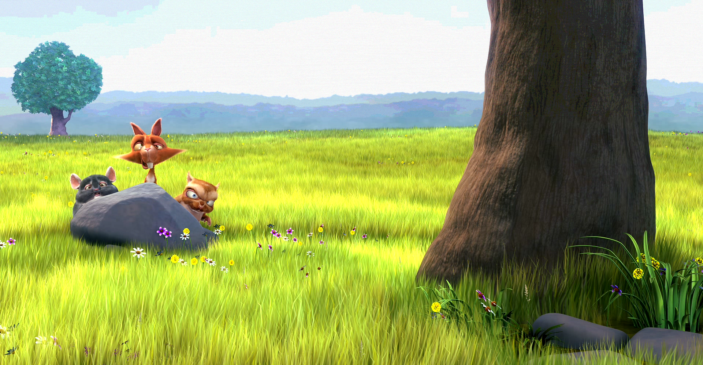
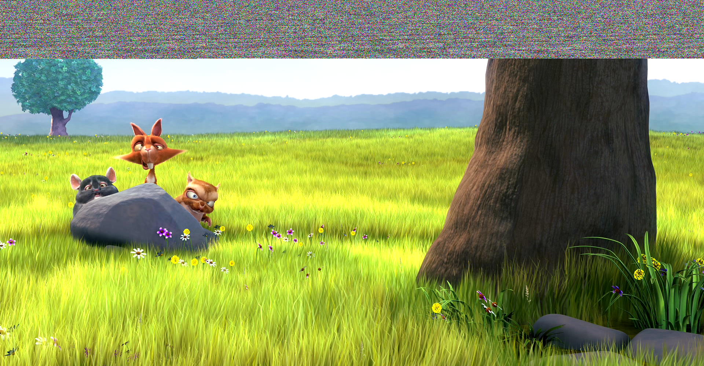

# HideIt
Uses last bit steganography technique to hide a file in a PNG image. An image is represented as 8-bit RGB values for each pixel in the Image. 
If 1 or 2 lower order bits of an image are altered, then there is no change in the image which is noticable by naked eye. 
So using this to our advantage, we can hide data from another file in these 1 or 2 lower order bits without any noticable change or increase in size. 
Let say we have a 1280x720 image, so number of pixels in it are 921600. Also, the image has 3 channels i.e RGB, so actually the image is made up of 921600*3 = 2764800 8-bit values. If we use 2 lower order bits from each of these values, then we can hide a file of size upto 2764800 * 2 = 5529600 or 5.53 Megabits(Mb), thats a very large space for text data and some small size images can also be hidden. 
As the number of bits used increase or the size of image increases, we can hide even more data in the image but the disadvantage of this is that the change might be noticable.

<h4>Main Image</h4>

<h4>Hidden Image</h4>

